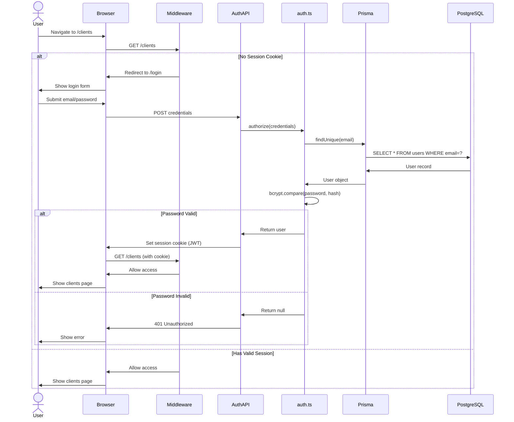
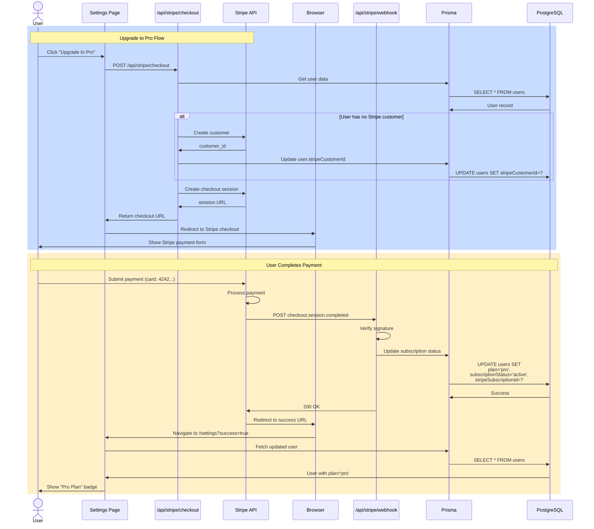
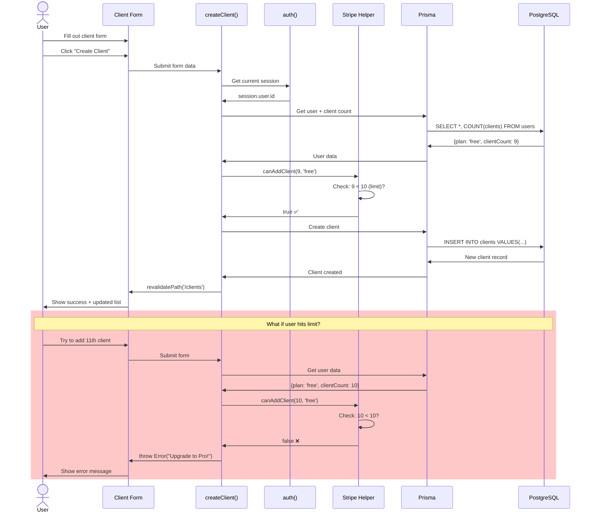
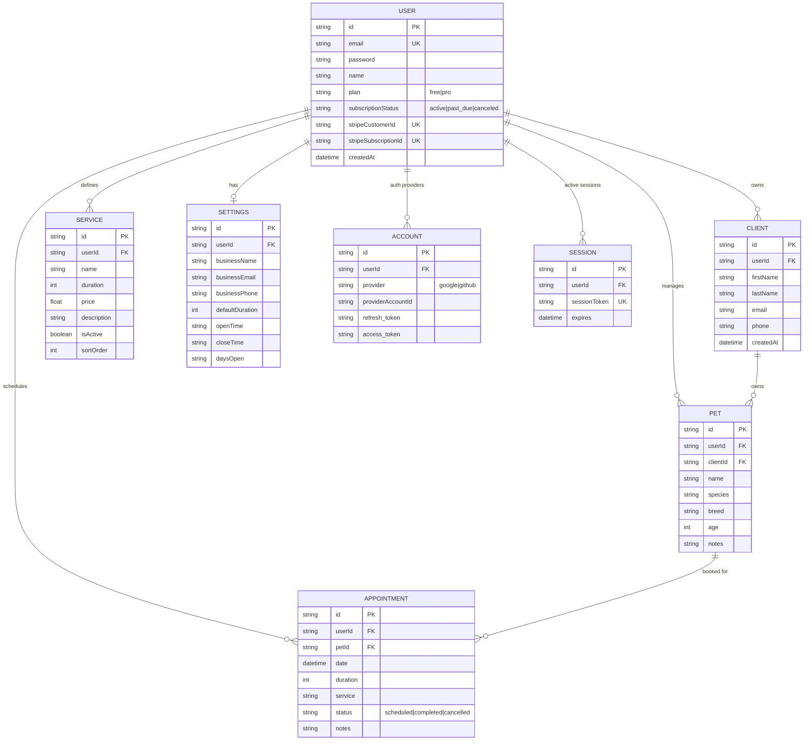
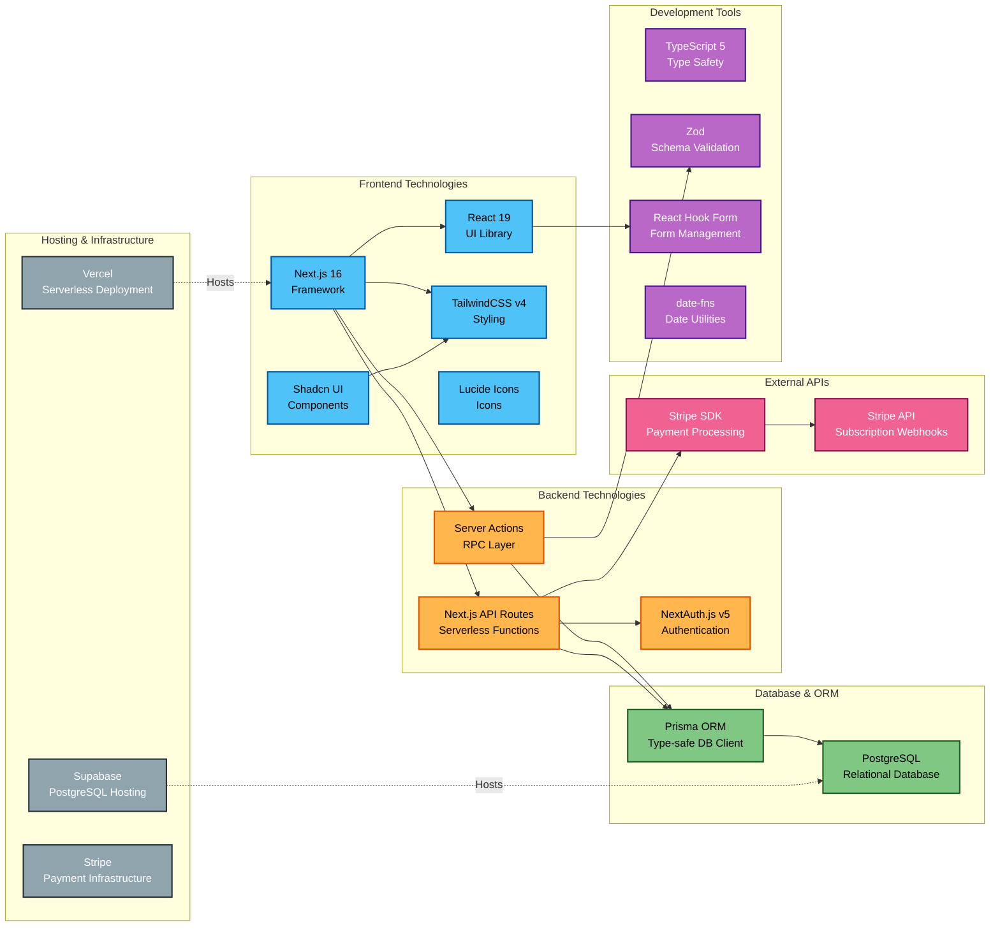
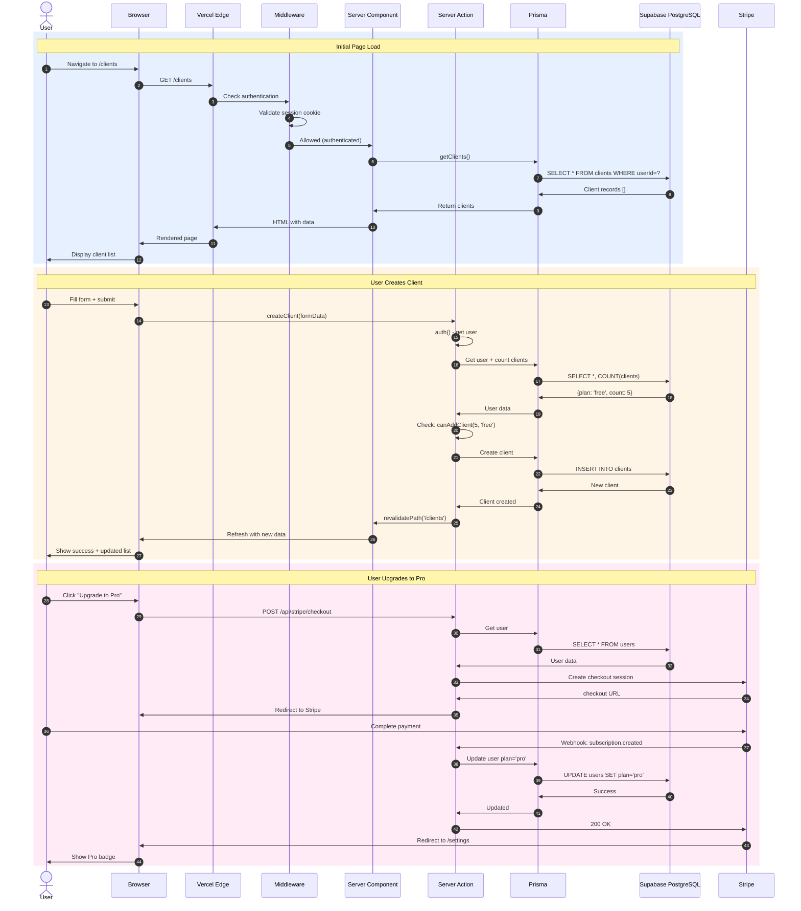
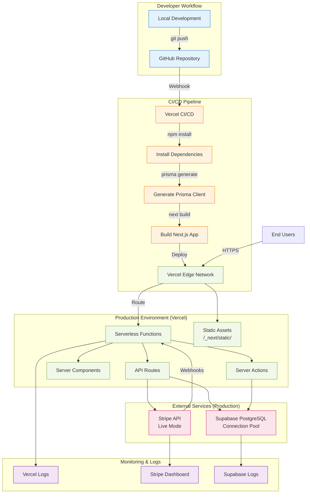

# GroomIQ Architecture Diagram

**Visual architecture diagrams for technical interviews and documentation**

---

## 1. Overall System Architecture

```mermaid
graph TB
    subgraph "Client Layer (Browser)"
        UI[React 19 UI Components]
        Pages[Next.js Pages]
        Forms[Forms & Inputs]
        Calendar[Calendar View]
    end

    subgraph "Application Layer (Next.js 16 on Vercel)"
        subgraph "Frontend (Server Components)"
            HomePage[Dashboard/page.tsx]
            ClientsPage[Clients/page.tsx]
            PetsPage[Pets/page.tsx]
            SchedulePage[Schedule/page.tsx]
            SettingsPage[Settings/page.tsx]
        end
        
        subgraph "Backend (Server Actions)"
            ClientActions[actions/clients.ts]
            PetActions[actions/pets.ts]
            ApptActions[actions/appointments.ts]
            ServiceActions[actions/services.ts]
            SettingsActions[actions/settings.ts]
        end
        
        subgraph "API Routes"
            AuthAPI[api/auth/[...nextauth]]
            SignupAPI[api/auth/signup]
            ProfileAPI[api/user/profile]
            CheckoutAPI[api/stripe/checkout]
            PortalAPI[api/stripe/portal]
            WebhookAPI[api/stripe/webhook]
        end
        
        Middleware[middleware.ts<br/>Auth Guard]
        AuthConfig[auth.ts<br/>NextAuth Config]
    end

    subgraph "Data Layer"
        Prisma[Prisma ORM]
        
        subgraph "Database (PostgreSQL on Supabase)"
            UserTable[(User Table<br/>+Stripe fields)]
            ClientTable[(Client Table)]
            PetTable[(Pet Table)]
            ApptTable[(Appointment Table)]
            ServiceTable[(Service Table)]
            SettingsTable[(Settings Table)]
        end
    end

    subgraph "External Services"
        Stripe[Stripe API<br/>Payment Processing]
        Supabase[Supabase<br/>PostgreSQL Hosting]
        Vercel[Vercel<br/>Deployment Platform]
    end

    %% User Interactions
    UI --> Pages
    Pages --> Middleware
    Middleware -->|Authenticated| HomePage
    Middleware -->|Not Authenticated| AuthAPI
    
    %% Page to Actions
    HomePage --> ApptActions
    ClientsPage --> ClientActions
    PetsPage --> PetActions
    SchedulePage --> ApptActions
    SettingsPage --> SettingsActions
    
    %% Actions to Database
    ClientActions --> Prisma
    PetActions --> Prisma
    ApptActions --> Prisma
    ServiceActions --> Prisma
    SettingsActions --> Prisma
    
    %% API Routes
    Forms --> SignupAPI
    Forms --> CheckoutAPI
    SettingsPage --> PortalAPI
    Stripe --> WebhookAPI
    
    %% Auth Flow
    AuthAPI --> AuthConfig
    AuthConfig --> Prisma
    
    %% Database Connections
    Prisma --> UserTable
    Prisma --> ClientTable
    Prisma --> PetTable
    Prisma --> ApptTable
    Prisma --> ServiceTable
    Prisma --> SettingsTable
    
    %% External Services
    Prisma -.->|Connection Pool| Supabase
    CheckoutAPI --> Stripe
    PortalAPI --> Stripe
    WebhookAPI --> Stripe
    Vercel -.->|Hosts| Middleware
    
    %% Data Relationships
    UserTable ---|1:N| ClientTable
    UserTable ---|1:N| PetTable
    UserTable ---|1:N| ApptTable
    ClientTable ---|1:N| PetTable
    PetTable ---|1:N| ApptTable

    classDef frontend fill:#e1f5ff,stroke:#0288d1,stroke-width:2px
    classDef backend fill:#fff3e0,stroke:#f57c00,stroke-width:2px
    classDef database fill:#f1f8e9,stroke:#689f38,stroke-width:2px
    classDef external fill:#fce4ec,stroke:#c2185b,stroke-width:2px
    
    class UI,Pages,Forms,Calendar,HomePage,ClientsPage,PetsPage,SchedulePage,SettingsPage frontend
    class ClientActions,PetActions,ApptActions,ServiceActions,SettingsActions,AuthAPI,SignupAPI,ProfileAPI,CheckoutAPI,PortalAPI,WebhookAPI,Middleware,AuthConfig backend
    class Prisma,UserTable,ClientTable,PetTable,ApptTable,ServiceTable,SettingsTable database
    class Stripe,Supabase,Vercel external
```

---

## 2. Authentication Flow



---

## 3. Payment/Subscription Flow



---

## 4. Client Creation Flow (with Plan Limit Check)



---

## 5. Database Schema (Entity Relationship)



---

## 6. Technology Stack Landscape



---

## 7. Request/Response Flow (Full Stack)



---

## 8. Deployment Architecture



---

## Technical Interview Talking Points

### Architecture Decisions

1. **Why Next.js 16 App Router?**
   - Server Components reduce JavaScript sent to browser
   - Server Actions eliminate need for separate API layer for mutations
   - Built-in middleware for authentication
   - Automatic code splitting and optimization
   - Serverless deployment on Vercel

2. **Why Prisma ORM?**
   - Type-safe database queries (TypeScript)
   - Schema migration management
   - Connection pooling out of the box
   - Great developer experience with auto-completion

3. **Why NextAuth.js?**
   - Industry standard for Next.js authentication
   - JWT strategy for stateless auth (scalable)
   - Built-in CSRF protection
   - Easy to add OAuth providers later

4. **Why Stripe for Payments?**
   - Most developer-friendly payment API
   - Built-in subscription management
   - Webhooks for real-time updates
   - PCI compliance handled by Stripe
   - Hosted checkout = no PCI scope for us

5. **Why Supabase for Database?**
   - Managed PostgreSQL (no DevOps)
   - Connection pooling built-in
   - Automatic backups
   - Good free tier for development
   - Easy to scale

### Scalability Considerations

- **Database**: Supabase handles connection pooling, can scale to thousands of connections
- **Application**: Serverless functions auto-scale based on traffic
- **Caching**: Next.js caches server components, reducing database queries
- **Subscription Limits**: Client limits prevent abuse on free tier

### Security Features

- **Authentication**: JWT tokens, bcrypt password hashing (10 rounds)
- **Authorization**: Middleware checks on every request
- **CSRF Protection**: NextAuth built-in protection
- **SQL Injection**: Prisma parameterizes all queries
- **Webhook Verification**: Stripe signature validation
- **Environment Variables**: Secrets never in code, only in Vercel

### Performance Optimizations

- **Server Components**: 40% less JavaScript sent to browser
- **Code Splitting**: Each page loads only what it needs
- **Database Indexes**: Prisma auto-indexes foreign keys
- **Connection Pooling**: Reuses database connections
- **Edge Caching**: Vercel CDN caches static assets globally

---

**Use this diagram to explain GroomIQ's architecture to:**
- Technical interviewers
- New developers joining the project
- Stakeholders wanting to understand the tech stack
- Your future self when you forget how it all works! 😄
